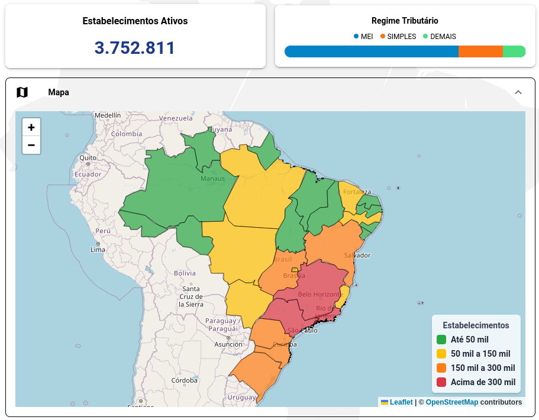

_Publicado em 05 de novembro de 2025._

O ano de 2025 viu a abertura de impressionantes **3.752.811 novos estabelecimentos** no Brasil até setembro. Mas quem são eles, onde estão e em que setores atuam?

Analisamos os dados da **Base CNPJ de Outubro/2025** (referente ao período até 30 de setembro) para criar um mapa completo do novo cenário empresarial do país.

### Onde estão as Novas Empresas? O Top 5 dos Estados

O eixo Sul-Sudeste continua a dominar a criação de novos negócios, com São Paulo abrindo quase o triplo de empresas do que o segundo colocado, Minas Gerais.

1.  **SP:** 1.106.638
2.  **MG:** 396.467
3.  **RJ:** 304.757
4.  **PR:** 267.473
5.  **RS:** 225.146

> **🗺️ Quer ver esses números em um mapa?**
>
> Para uma análise mais visual, explore nosso **[Mapa Interativo de Empresas](https://linhasecolunas.com.br/mapa-de-empresas)**.
>
> 
>
> Lá você pode navegar do Brasil até o seu município, ver o *mapa de calor* da concentração de empresas e filtrar entre os dados "Geral" ou apenas de "2025", vendo a divisão exata por MEI, Simples e Demais ao passar o mouse.

### O quê? Os Setores Mais Procurados em 2025

A tendência de digitalização e serviços de baixo custo inicial é clara. O setor de "Promoção de Vendas" — um CNAE "guarda-chuva" para afiliados digitais, gestores de tráfego e promotores — liderou com folga.

1.  **Promoção de vendas** (CNAE 7319002): 174.185 empresas
2.  **Preparação de documentos e apoio adm.** (CNAE 8219999): 142.983 empresas
3.  **Comércio varejista de vestuário** (CNAE 4781400): 125.402 empresas
4.  **Cabeleireiros, manicure e pedicure** (CNAE 9602501): 124.886 empresas
5.  **Transporte rodoviário de carga (Municipal)** (CNAE 4930201): 114.123 empresas

### Como? O Perfil do Novo Empreendedor

Analisando o perfil tributário e estrutural desses 3,7 milhões de estabelecimentos, surgem dois insights cruciais:

#### 1. A Era do MEI: O Negócio Próprio Começa Pequeno

Não é surpresa que a maioria esmagadora tenha começado como MEI. A facilidade de abertura domina o cenário:

* **MEI:** 2.707.156 (72,1%)
* **SIMPLES:** 687.951 (18,3%)
* **DEMAIS:** 357.704 (9,5%)

Isso fica evidente ao olharmos o setor número 1, "Promoção de Vendas", onde **90%** dos novos registros foram MEIs (157 mil de 174 mil).

#### 2. Matriz vs. Filial: Novos Negócios vs. Expansão

Talvez o dado mais estratégico seja este: qual a origem desses estabelecimentos? São novas empresas ou expansões?

* **MATRIZ (Novos Negócios):** 3.652.104 (97,3%)
* **FILIAL (Expansão):** 100.707 (2,7%)

Isso mostra que o volume é impulsionado por **novos empreendedores**.

No entanto, as **100.707 novas filiais** representam um público totalmente diferente: são empresas estabelecidas, com capital, que estão ativamente expandindo seus pontos de venda, centros de distribuição ou escritórios.

Para contadores, advogados e empresas B2B, isso divide o mercado em duas oportunidades claras:
1.  **3,6 milhões de Matrizes:** Novos empreendedores, novos clientes.
2.  **100 mil Filiais:** Clientes maduros, em expansão, com maior poder de compra.

---

### Acesse os Dados Completos

Esta análise é apenas um *snapshot* nacional de um único ano.

Com a **Base CNPJ**, você tem acesso integral. Em vez de ler este resumo, você pode baixar a lista completa com todas as **3,7 milhões** de novas empresas — ou os **26 milhões** de empresas ativas totais.

Filtre por UF, município, regime tributário ou qualquer um dos 1.300 CNAEs.

 

    <a href="https://linhasecolunas.com.br/base-cnpj" class="btn btn-primary btn-lg" role="button">
        ADQUIRIR ACESSO AGORA
    </a>

 

---

> **📊 Metodologia**
>
> Os dados apresentados neste relatório são baseados nos arquivos oficiais da Receita Federal, processados em outubro de 2025. Os números referem-se exclusivamente a estabelecimentos com data de abertura em 2025, independentemente de sua situação cadastral atual.
>
> **Sobre a nomenclatura "Base de Outubro":**
> A Receita Federal disponibiliza os dados mensalmente com o nome do mês seguinte ao período de referência. Assim, a "Base de Outubro/2025" contém todas as empresas abertas **até 30 de setembro de 2025**. Este é o padrão oficial adotado pela Receita Federal para todas as suas bases públicas.
>
> - **Empresas Ativas:** CNPJs com situação cadastral "02 - ATIVA"
> - **Regime Tributário:** Classificação entre MEI, Simples Nacional e Demais regimes
> - **Tipo de Estabelecimento:** Matriz (primeiro estabelecimento da empresa) ou Filial (estabelecimentos adicionais)
